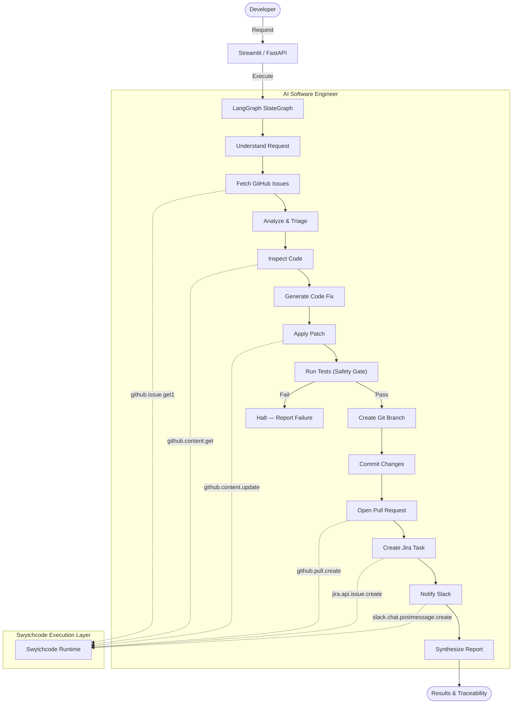

# DevPilot

**Autonomous AI Software Engineering Agent**
*Buildathon: Build with Swytchcode — Gurgaon Edition (Track 1: AI Software Engineer)*

---

## Overview

**DevPilot** is an autonomous AI Software Engineer that automates end-to-end coding workflows. Powered by **LangGraph** and the **Swytchcode Execution Authority**, DevPilot inspects real repositories, diagnoses root causes via AST analysis, generates code fixes with unified diffs, runs automated tests as a safety gate, creates Git branches, commits verified changes, opens Pull Requests, tracks work in Jira, and broadcasts alerts on Slack.

### Core Workflow

```
User Request → Understand → Plan → Inspect Repository → Analyze Code
    → Generate Fix → Run Tests → Create Branch → Commit → Push
    → Open PR → Jira Tracking → Slack Notification → Result
```

---

## Track 1: Alignment

| Problem Statement | DevPilot Implementation |
| :--- | :--- |
| **Understand Development Tasks** | NLP intent parser extracts task type, target issue, and required tools from natural language. |
| **Work with Code Repositories** | Reads real code via `github.content.get`, generates patches, commits via Git, opens PRs via `github.pull.create`. |
| **Run Tests** | Executes `pytest` as a safety gate — blocks PR creation if tests fail. |
| **Track Issues** | Retrieves and triages GitHub issues, creates Jira tasks via `jira.api.issue.create`. |
| **Assist Development Teams** | Posts Slack alerts via `slack.chat.postmessage.create` with PR links and Jira tickets. |

---

## Architecture



---

## Key Features

- **Real Code Operations**: Reads real source files, writes real patches, runs real `pytest`, creates real Git branches with actual commit SHAs.
- **Test Safety Gate**: Blocks PR creation when tests fail — never pushes broken code.
- **Conditional Agent**: Different requests trigger different workflow paths. Investigate-only skips code changes; Jira/Slack only when explicitly requested.
- **AST-Based Defect Scanner**: Detects CWE-681 (float precision), CWE-89 (SQL injection), CWE-532 (credential logging), CWE-775 (resource leaks), PEP-484 (mutable defaults).
- **End-to-End Traceability**: Links Issue → Patch → Tests → Branch → Commit → PR → Jira → Slack.
- **Premium UI**: IDE-like workspace with execution timeline, code diff viewer, test results, PR review cards, and audit trail.
- **Dual Execution Modes**: Real mode (live Git + Swytchcode) and Demo mode (offline simulation).

---

## Swytchcode Integrations

| Provider | Tool ID | Role |
| :--- | :--- | :--- |
| **GitHub** | `github.issue.get1` | Retrieve open issues |
| **GitHub** | `github.content.get` | Read source code files |
| **GitHub** | `github.content.update` | Commit code patches |
| **GitHub** | `github.pull.create` | Open Pull Requests |
| **Jira** | `jira.api.issue.create` | Create tracked tasks |
| **Slack** | `slack.chat.postmessage.create` | Send team alerts |

---

## Tech Stack

- **Agent**: LangGraph (StateGraph, conditional routing)
- **Execution**: Swytchcode Runtime
- **UI**: Streamlit 1.64
- **API**: FastAPI + SSE (Server-Sent Events)
- **Validation**: Pydantic v2
- **Testing**: Pytest 9.1
- **Language**: Python 3.12

---

## Setup

```bash
cd /home/nikhil-mutreja/buildathon
source .venv/bin/activate
pip install -r requirements.txt
```

## Running

### Streamlit UI
```bash
streamlit run app/ui/streamlit_app.py
```

### FastAPI Backend (optional)
```bash
uvicorn app.api.server:app --host 0.0.0.0 --port 8000
```

---

## Test Repositories

| Repository | Defects | Tests |
| :--- | :--- | :--- |
| `real_test_repo` | Greeter edge-case (empty/whitespace name) | ✅ 3 tests |
| `ecommerce_service` | CWE-681, CWE-89, CWE-775 | ✅ Tests included |
| `auth_microservice` | CWE-532, PEP-484 | ✅ Tests included |
| `realtime_stream_service` | CWE-775 (connection pool) | — |

---

## Testing

```bash
pytest -v
```

**23 tests** covering:
- Intent parsing and tool selection
- Severity triage classification
- Code patch generation and unified diff
- Full autonomous workflow (Issue → Fix → Tests → PR → Jira → Slack)
- Real-mode end-to-end lifecycle
- Safety gate (test failure blocks PR)
- Investigate-only mode
- Multi-repository isolation
