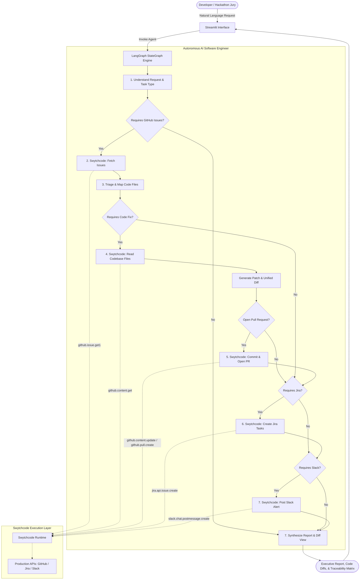

# DevPilot

**Autonomous AI Software Engineering Agent**  
*Buildathon: Build with Swytchcode — Gurgaon Edition (Track 1: AI Software Engineer)*

---

## Overview

**DevPilot** is an autonomous AI Software Engineer that automates end-to-end coding workflows, issue management, task tracking, and developer communication. Powered by **LangGraph** and the **Swytchcode Execution Authority**, DevPilot goes beyond simple triage: it understands software engineering tasks, inspects repository source code, diagnoses root causes, generates code fixes and unified diffs, opens GitHub Pull Requests, creates tracked Jira engineering tasks, and broadcasts real-time status alerts on Slack.

Critically, DevPilot operates as a **true autonomous agent**:
1. Understands natural language development tasks (bug fixes, feature implementations, security remediations, or repo triage).
2. Autonomously selects only the required tools.
3. Inspects codebase files and analyzes root causes.
4. Generates code patches and creates Pull Requests.
5. Tracks work in Jira with complete bidirectional traceability.
6. Dispatches actionable Slack alerts to the engineering team.

---

## Track 1: Alignment & Objective

| Problem Statement & Objective | DevPilot Implementation |
| :--- | :--- |
| **Understand Development Tasks** | Natural language intent parser extracts task type (`bug_fix`, `feature_development`, `issue_triage`), target issue number, and required tool actions. |
| **Work with Code Repositories** | Reads repository source code via `github.content.get`, generates unified diff patches, commits changes via `github.content.update`, and opens Pull Requests via `github.pull.create`. |
| **Track Issues** | Retrieves and triages GitHub issues (`github.issue.get1`), assesses severity (`CRITICAL`, `HIGH`, `MEDIUM`, `LOW`), and creates tracked Jira tasks (`jira.api.issue.create`). |
| **Assist Development Teams** | Posts rich Slack alerts (`slack.chat.postmessage.create`) detailing the root cause, Pull Request link for review, and Jira ticket key. |
| **Automate Coding Workflows** | Seamless end-to-end loop: Task Request → Code Inspection → Patch Generation → Pull Request → Jira Task → Slack Broadcast. |

---

## Architecture



---

## Key Features

- **Automated Coding Workflows**: Not just issue triage—reads source files, diagnoses defects, generates unified diffs, and opens Pull Requests.
- **Swytchcode Execution Layer**: Integrates schema-validated tools for GitHub, Jira, and Slack registered in `.swytchcode/tooling.json`.
- **True Conditional Orchestration**: Avoids fixed linear pipelines. Prompts only requesting triage don't generate PRs; coding tasks trigger the full code-inspection and PR loop.
- **Complete End-to-End Traceability**: Links `GitHub Issue #102` $\rightarrow$ `Code Patch` $\rightarrow$ `Pull Request #45` $\rightarrow$ `Jira DEV-202` $\rightarrow$ `Slack Alert`.
- **Dual Execution Modes**:
  - `REAL MODE`: Connects to live Swytchcode runtime and external APIs.
  - `DEMO / MOCK MODE`: Full-fidelity offline simulation for testing without third-party credential dependencies.
- **Interactive Streamlit Dashboard**: Clean UI with quick-launch tasks (Bug Fix + PR, Security Remediation, Feature Development, Repo Triage), live metrics, diff viewers, and audit logs.

---

## Swytchcode Integrations

DevPilot utilizes canonical Swytchcode tools registered in `.swytchcode/tooling.json`:

| Provider | Canonical Tool ID | Role in DevPilot |
| :--- | :--- | :--- |
| **GitHub** | `github.issue.get1` | Retrieves open repository issues and PRs |
| **GitHub** | `github.content.get` | Reads repository source code files for root-cause inspection |
| **GitHub** | `github.content.update` | Commits code patches to branches |
| **GitHub** | `github.pull.create` | Opens Pull Requests linking the target issue |
| **Jira** | `jira.api.issue.create` | Generates tracked tasks linking GitHub issue and PR |
| **Slack** | `slack.chat.postmessage.create` | Broadcasts alerts with PR links and Jira tickets |

---

## Tech Stack

- **Agent Framework**: LangGraph (`StateGraph`, conditional edge routing)
- **Execution Authority**: Swytchcode (`swytchcode-runtime` Python SDK & `swy` CLI kernel)
- **Data Validation & State**: Pydantic v2 & Python `TypedDict`
- **User Interface**: Streamlit 1.64
- **Testing**: Pytest 9.1
- **Language / Environment**: Python 3.12, Linux

---

## Setup

### Prerequisites
- Python 3.10+
- Node.js 18+ (for Swytchcode CLI)

### Installation

1. **Navigate to the workspace:**
   ```bash
   cd /home/nikhil-mutreja/buildathon
   ```

2. **Activate the virtual environment:**
   ```bash
   source .venv/bin/activate
   ```

3. **Install dependencies:**
   ```bash
   pip install -r requirements.txt
   ```

---

## Environment Variables

Copy `.env.example` to `.env`:
```bash
cp .env.example .env
```

| Variable | Description | Default |
| :--- | :--- | :--- |
| `APP_MODE` | Application mode: `mock` (demo simulation) or `real` (live Swytchcode) | `mock` |
| `SWYTCHCODE_TOKEN` | Swytchcode service token for managed execution | Optional in mock mode |
| `GITHUB_TOKEN` | GitHub Personal Access Token | Optional in mock mode |
| `GITHUB_REPO_OWNER` | Target GitHub repository owner / org | `octocat` |
| `GITHUB_REPO_NAME` | Target GitHub repository name | `Hello-World` |
| `JIRA_PROJECT_KEY` | Target Jira project key | `DEV` |
| `SLACK_CHANNEL` | Target Slack alert channel | `#dev-alerts` |

---

## Running

Launch the Streamlit demonstration dashboard:
```bash
streamlit run app/ui/streamlit_app.py
```
Open your browser at `http://localhost:8501`.

---

## Example Tasks & Prompts

### 1. Autonomous Bug Fix & Pull Request
> *"Investigate and fix bug #102: payment gateway 500 error on checkout, open a pull request with the fix, create a Jira task, and notify Slack."*
- **Path**: Understand $\rightarrow$ Fetch GitHub Issue $\rightarrow$ Inspect `src/services/payment_service.py` $\rightarrow$ Generate Decimal arithmetic patch $\rightarrow$ Open PR $\rightarrow$ Create Jira `DEV-202` $\rightarrow$ Post Slack Alert.

### 2. Security Vulnerability Remediation
> *"Remediate critical security vulnerability #101: token leakage in OAuth callback, generate code patch, open PR, track in Jira, and alert the team on Slack."*
- **Path**: Inspect `src/auth/oauth_handler.py` $\rightarrow$ Generate token masking patch $\rightarrow$ Open PR $\rightarrow$ Create Jira `DEV-201` $\rightarrow$ Post Slack Alert.

### 3. Feature Development
> *"Implement dark mode theme switcher #105, commit the frontend changes, create a pull request, create a Jira ticket, and notify Slack."*
- **Path**: Inspect `src/components/ThemeToggle.tsx` $\rightarrow$ Generate theme persistence patch $\rightarrow$ Open PR $\rightarrow$ Create Jira `DEV-205` $\rightarrow$ Post Slack Alert.

### 4. Issue Triage & Backlog Sync
> *"Analyze latest GitHub repository issues, identify critical items, create Jira tasks, and notify the team on Slack."*
- **Path**: Fetch Issues $\rightarrow$ Triage Severities $\rightarrow$ Create Jira Tasks $\rightarrow$ Notify Slack.

---

## Testing

Run the automated test suite with pytest:
```bash
pytest -v
```

The test suite validates:
1. Tool selection and task intent mapping (`bug_fix`, `feature_development`, `issue_triage`)
2. Severity triage classification (`CRITICAL`, `HIGH`, `MEDIUM`, `LOW`)
3. Code patch generation and unified diff syntax
4. Full autonomous coding workflow (Issue $\rightarrow$ Code Fix $\rightarrow$ PR $\rightarrow$ Jira $\rightarrow$ Slack)
5. Conditional skipping: GitHub-only workflow
6. Conditional skipping: GitHub + Jira workflow
7. Mock client capability and interface parity

---

## Limitations

- **Rate Limits**: In live mode, GitHub and Jira rate limits apply based on the connected account's quota.
- **Complex Multi-file Refactoring**: Single-task fixes focus on the primary offending file identified during codebase inspection.
- **Jira Permissions**: Issue creation requires create permissions on the target Jira project key.
