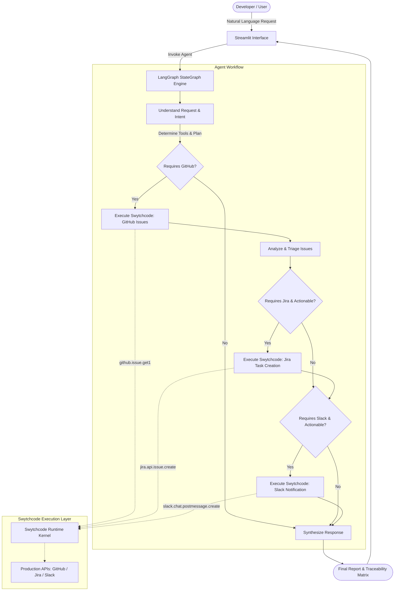

# DevPilot

**Autonomous AI Software Engineering Agent**  
*Buildathon: Build with Swytchcode — Gurgaon Edition (Track 1: AI Software Engineer)*

---

## Overview

**DevPilot** is an autonomous AI software engineering agent that orchestrates real-world development workflows across repositories, issue trackers, and team communication channels. Powered by **LangGraph** and the **Swytchcode Execution Authority**, DevPilot autonomously inspects GitHub issues, performs severity triage and impact analysis, creates tracked Jira engineering tasks for actionable issues, and broadcasts targeted Slack alerts to engineering teams—completely driven by natural-language developer intent and dynamic conditional logic.

Unlike rigid hardcoded pipelines or generic chatbots, DevPilot operates as an autonomous agent: it understands developer intent, selects only the required tools, evaluates intermediate API outputs, decides follow-up actions dynamically, and maintains complete source-to-action traceability.

---

## Problem

Modern engineering teams suffer from fragmented workflows and triage fatigue:
- High-severity bugs and security vulnerabilities sit buried in GitHub issues.
- Developers manually copy-paste issue details into Jira tasks to track work.
- Urgent production incidents fail to reach the right engineers on Slack in real time.
- Traditional automation scripts are brittle, inflexible, and follow hardcoded routes regardless of context or developer intent.

---

## Solution

DevPilot bridges code repositories, project tracking, and team messaging through an intelligent, conditional agent:
1. **Understands Natural Language**: Interprets complex developer requests and derives precise workflow goals.
2. **Autonomous Tool Selection**: Chooses only the necessary Swytchcode tools based on requested intent.
3. **Deep Issue Triage**: Evaluates real repository issue data to classify severity (`CRITICAL`, `HIGH`, `MEDIUM`, `LOW`) with clear reasoning.
4. **Conditional Task Tracking**: Automatically generates Jira issues for critical/high items with GitHub traceability links.
5. **Dynamic Team Alerts**: Dispatches rich Slack notifications only when actionable issues warrant team attention.
6. **Auditability & Traceability**: Provides full visibility into agent decisions, actions taken, and linked artifacts.

---

## Key Features

- **True Conditional Orchestration**: Does NOT execute a fixed linear pipeline. GitHub-only requests query GitHub; Jira and Slack are called only when requested and when actionable items exist.
- **Swytchcode Execution Layer**: Integrates directly with Swytchcode's schema-validated tools, policy governance, and managed authentication.
- **Severity-Based Triage**: Evaluates title, body, labels, and impact to identify production-critical defects vs routine enhancements.
- **Source-to-Action Traceability**: Preserves end-to-end traceability (`GitHub #102` → `Jira DEV-202` → `Slack Alert`).
- **Dual Execution Modes**:
  - `REAL MODE`: Connects to live Swytchcode runtime and external APIs.
  - `DEMO / MOCK MODE`: Full fidelity offline simulation for judging and testing without requiring third-party credentials.
- **Interactive Streamlit Dashboard**: Clean, intuitive UI with one-click quick demo prompts, live metric counters, triage cards, and decision audit logs.

---

## Architecture



---

## Agent Workflow

DevPilot's LangGraph StateGraph executes across discrete, auditable nodes:

1. **Understand Request (`understand_request_node`)**:
   Analyzes natural language instructions to determine intent (`needs_github`, `needs_jira`, `needs_slack`) and selects canonical Swytchcode tools.
2. **Fetch Issues (`fetch_github_node`)**:
   Calls Swytchcode `github.issue.get1` to retrieve open issues from the repository.
3. **Analyze Issues (`analyze_issues_node`)**:
   Evaluates issue details (title, description, labels, comments) to classify severity (`CRITICAL`, `HIGH`, `MEDIUM`, `LOW`) and flags actionable items with transparent reasoning.
4. **Conditional Jira Creation (`create_jira_node`)**:
   Evaluated conditionally: if Jira is requested AND actionable issues exist, creates structured Jira tasks using `jira.api.issue.create`.
5. **Conditional Slack Notification (`send_slack_node`)**:
   Evaluated conditionally: if team notification is requested AND actionable updates exist, constructs a dynamic message referencing the Jira tasks and posts via `slack.chat.postmessage.create`.
6. **Synthesize Response (`synthesize_response_node`)**:
   Compiles the executive summary, traceability matrix, decision log, and execution audit trail.

---

## Swytchcode Integrations

DevPilot utilizes 3 canonical Swytchcode APIs registered in `.swytchcode/tooling.json`:

| Provider | Canonical Tool ID | Purpose in DevPilot | Downstream Influence |
| :--- | :--- | :--- | :--- |
| **GitHub** | `github.issue.get1` | Retrieves open repository issues and PRs | Issues are triaged; actionable findings dictate Jira task creation |
| **Jira** | `jira.api.issue.create` | Generates tracked tasks for actionable bugs | Generated Jira ticket key (`DEV-XXX`) is linked into the Slack alert |
| **Slack** | `slack.chat.postmessage.create` | Broadcasts alerts to the development team | Formatted dynamically from actual GitHub + Jira results |

---

## Tech Stack

- **Agent Framework**: LangGraph (`StateGraph`, conditional edge routing)
- **Execution Authority**: Swytchcode (`swytchcode-runtime` Python SDK & `swy` CLI kernel)
- **Data Validation & State**: Pydantic v2 & Python `TypedDict`
- **User Interface**: Streamlit
- **Testing**: Pytest
- **Runtime Environment**: Python 3.12, Linux

---

## Setup

### Prerequisites
- Python 3.10+
- Node.js 18+ (for Swytchcode CLI)

### Installation

1. **Clone the repository:**
   ```bash
   git clone <repo-url>
   cd buildathon
   ```

2. **Create and activate a virtual environment:**
   ```bash
   python3 -m venv .venv
   source .venv/bin/activate
   ```

3. **Install dependencies:**
   ```bash
   pip install -r requirements.txt
   ```

4. **Initialize Swytchcode tools (already bundled in `.swytchcode/`):**
   ```bash
   npm install swytchcode
   ```

---

## Environment Variables

Copy `.env.example` to `.env`:
```bash
cp .env.example .env
```

| Variable | Description | Default |
| :--- | :--- | :--- |
| `APP_MODE` | Application mode: `mock` (demo simulation) or `real` (live Swytchcode) | `mock` |
| `SWYTCHCODE_TOKEN` | Swytchcode service token for managed execution | Optional in mock mode |
| `GITHUB_TOKEN` | GitHub Personal Access Token | Optional in mock mode |
| `GITHUB_REPO_OWNER` | Target GitHub repository owner / org | `octocat` |
| `GITHUB_REPO_NAME` | Target GitHub repository name | `Hello-World` |
| `JIRA_PROJECT_KEY` | Target Jira project key | `DEV` |
| `SLACK_CHANNEL` | Target Slack alert channel | `#dev-alerts` |

---

## Running

Launch the Streamlit demonstration dashboard:
```bash
streamlit run app/ui/streamlit_app.py
```
Open your browser at `http://localhost:8501`.

---

## Example Prompts

DevPilot adapts its execution path dynamically based on the prompt:

### Prompt 1: GitHub Triage Only
> *"Analyze my GitHub issues, evaluate severity, and report actionable findings."*
- **Path**: Agent → GitHub → Issue Triage → Final Report
- **Result**: Triages issues; Jira and Slack are skipped.

### Prompt 2: GitHub + Jira Creation
> *"Find critical GitHub issues and create appropriate Jira tasks for our engineering backlog."*
- **Path**: Agent → GitHub → Issue Triage → Jira Task Creation → Final Report
- **Result**: Triages issues and creates Jira tasks (`DEV-201`, `DEV-202`); Slack is skipped.

### Prompt 3: Full End-to-End Orchestration
> *"Analyze critical GitHub issues, create Jira tasks, and notify the development team on Slack."*
- **Path**: Agent → GitHub → Issue Triage → Jira Task Creation → Slack Alert → Final Report
- **Result**: Full multi-step execution connecting GitHub, Jira, and Slack.

---

## Testing

Run the automated test suite with pytest:
```bash
pytest -v
```

The test suite validates:
1. Natural language tool selection and intent parsing
2. Issue triage and severity classification (`CRITICAL`, `HIGH`, `MEDIUM`, `LOW`)
3. Conditional workflow: GitHub-only requests
4. Conditional workflow: GitHub + Jira requests
5. Conditional workflow: Full end-to-end pipeline
6. Jira skipping when no actionable issues exist
7. Mock client capability and interface parity
8. Clean error handling on missing credentials / API failure

---

## Project Structure

```
buildathon/
│
├── app/
│   ├── __init__.py
│   ├── agent/
│   │   ├── __init__.py
│   │   ├── analyzer.py            # Intent parsing, issue triage, decision logic
│   │   ├── graph.py               # LangGraph workflow, nodes, and conditional edges
│   │   └── state.py               # DevPilotState TypedDict and Pydantic models
│   ├── integrations/
│   │   ├── __init__.py
│   │   └── swytchcode_client.py   # Swytchcode SDK & CLI adapter (Real & Mock modes)
│   └── ui/
│       ├── __init__.py
│       └── streamlit_app.py       # Streamlit interactive demonstration dashboard
│
├── tests/
│   └── test_agent_workflow.py     # End-to-end pytest test suite
│
├── .swytchcode/                   # Swytchcode configurations & integration bundles
│   ├── tooling.json               # Allow-listed tools (GitHub, Jira, Slack)
│   ├── workspace.json             # Swytchcode workspace definition
│   └── integrations/              # Provider bundles (GitHub, Jira, Slack)
│
├── .env.example                   # Environment configuration template
├── .gitignore                     # Git exclusion rules
├── pytest.ini                     # Pytest configuration
├── requirements.txt               # Python package dependencies
├── DEMO.md                        # 2.5-minute jury demonstration script
└── README.md                      # Complete project documentation
```

---

## Buildathon Requirement Mapping

| Buildathon Requirement | DevPilot Implementation |
| :--- | :--- |
| **Track 1: AI Software Engineer** | Understands development tasks, triages code issues, tracks tasks in Jira, and communicates on Slack |
| **Agentic Framework** | **LangGraph** `StateGraph` with typed state, functional nodes, and conditional routing edges |
| **Swytchcode API #1** | `github.issue.get1` (List repository issues) |
| **Swytchcode API #2** | `jira.api.issue.create` (Create issue/task) |
| **Swytchcode API #3** | `slack.chat.postmessage.create` (Send channel message) |
| **Multi-step API Integration** | GitHub issues → Issue Triage → Jira Task Creation → Slack Team Broadcast |
| **API Output Influences Follow-up** | GitHub issues determine if Jira is needed; Jira task keys are embedded into Slack alert |
| **Conditional Decision-Making** | Agent selects tools dynamically; skips Jira/Slack when not requested or non-actionable |
| **Interactive Demo** | Streamlit UI with quick demo buttons, live metrics, and traceability matrix |
| **Robust Error Handling** | Graceful degradation, error reporting, and zero silent failures |
| **Mock Mode** | `APP_MODE=mock` provides full-fidelity simulation when live API credentials are unavailable |

---

## Limitations

- **Rate Limits**: In live mode, GitHub and Jira rate limits apply based on the connected account's quota.
- **Jira Duplicate Detection**: Swytchcode Jira API creates issues as requested; duplicate detection requires querying JQL precomputations if project permissions allow.
- **Slack Formats**: Rich Block Kit attachments are supported in mock and real modes; plain text fallback is used for legacy webhooks.
